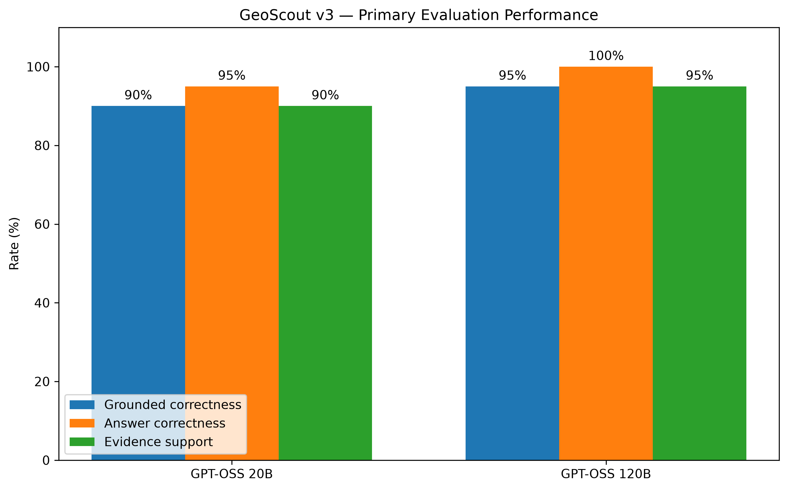
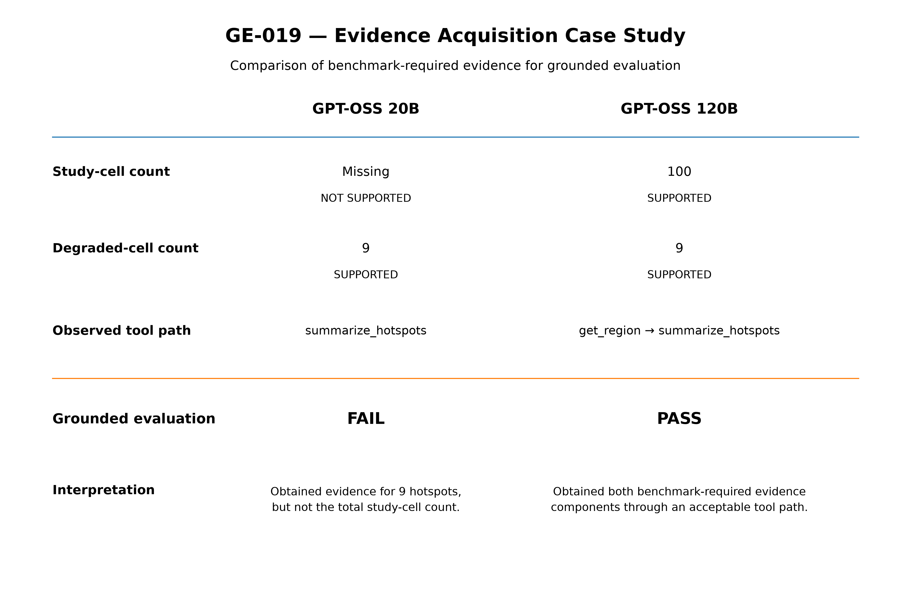
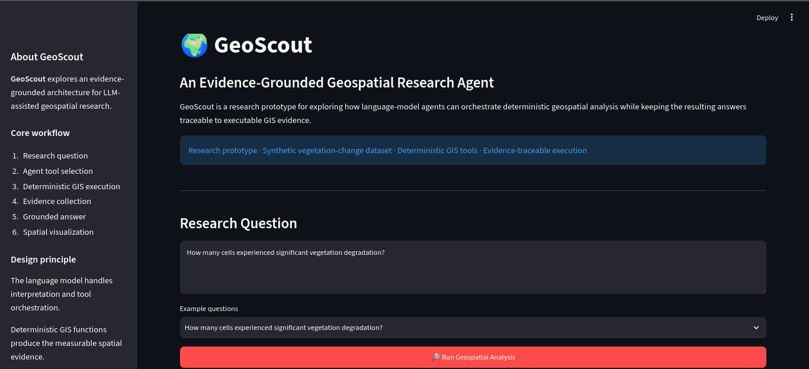
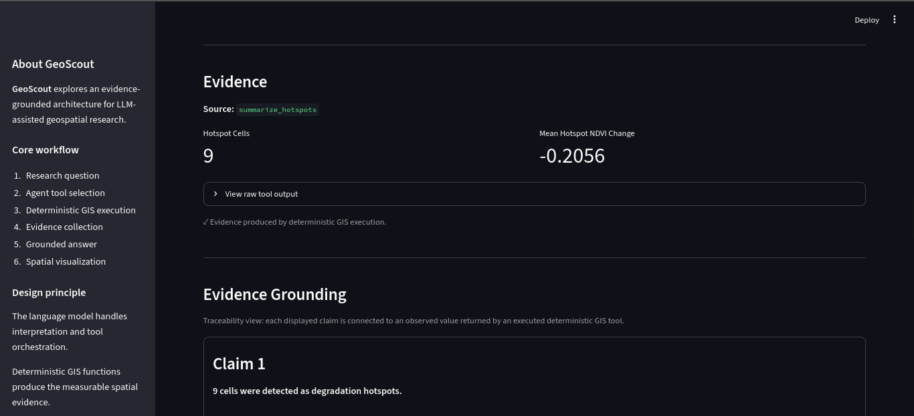

# GeoScout

> **An evidence-grounded AI agent for environmental geospatial analysis.**

GeoScout is an independent research prototype that explores how LLM agents can translate natural-language environmental questions into executable, observable, and evidence-grounded geospatial workflows.

The project investigates an important problem in **agentic GeoAI**: an agent may produce a plausible answer while selecting the wrong tools, failing to execute the required analysis, or making spatial claims that are not actually supported by the evidence it obtained.

GeoScout therefore separates **reasoning from computation**:

> **The LLM plans. Deterministic GIS tools compute. The evaluation system checks.**

---

## Research Motivation

Recent work such as the **GeoNatureAgent Benchmark** demonstrates that environmental geospatial analysis remains challenging for LLM agents, particularly when tasks require precise tool selection, multi-step reasoning, and reliable interaction with geospatial APIs.

GeoNatureAgent evaluates environmental analysis agents across a broad capability taxonomy including tool selection, spatial reasoning, error handling, temporal change, interpretation, and other capabilities.

GeoScout explores a complementary architectural question:

> **Can explicit workflow execution, deterministic geospatial tools, evidence tracing, and empirical evaluation make environmental geospatial agents more reliable and auditable?**

GeoScout is **not** a reproduction or official implementation of GeoNatureAgent, Darwin Geospatial, or any associated research project.

Instead, it is an **independent research prototype inspired by the broader problem of reliable agentic geospatial analysis**.

---

## Research Question

> **How reliably can an LLM agent plan and execute environmental geospatial analysis workflows using structured deterministic tools, while producing answers that are grounded in observable evidence?**

The current prototype focuses on four properties:

1. **Tool-use reliability** — Does the agent select and execute appropriate GIS tools?
2. **Answer correctness** — Does the final answer contain the correct result?
3. **Evidence grounding** — Can important claims be traced to tool-generated evidence?
4. **Observability** — Can the agent's workflow, tool calls, failures, latency, and token usage be inspected?

---

## Core Idea

GeoScout follows a simple architecture:

```text
Natural-language question
          │
          ▼
   LLM Agent / Planner
          │
          ▼
   Tool Selection
          │
          ▼
 Deterministic GIS Tools
          │
          ▼
     Tool Results
          │
          ▼
   Evidence Collection
          │
          ▼
      Evaluation
          │
          ▼
    Grounded Answer
```

The LLM is responsible for deciding **what analysis should be performed**.

The actual geospatial calculations are performed by deterministic Python tools rather than generated Python code.

This separation makes it possible to inspect what happened at each stage and evaluate the final answer against the evidence produced during execution.

---

# Architecture

GeoScout is organized around several layers.

```text
┌──────────────────────────────────────────────┐
│              Natural Language Query          │
└──────────────────────┬───────────────────────┘
                       │
                       ▼
┌──────────────────────────────────────────────┐
│              LLM Planning Layer              │
│                                              │
│  • interprets the question                   │
│  • selects tools                             │
│  • determines execution sequence             │
│  • synthesizes final response                │
└──────────────────────┬───────────────────────┘
                       │
                       ▼
┌──────────────────────────────────────────────┐
│               Tool Registry                  │
│                                              │
│  • structured schemas                        │
│  • validated arguments                       │
│  • deterministic execution                   │
└──────────────────────┬───────────────────────┘
                       │
                       ▼
┌──────────────────────────────────────────────┐
│             Geospatial Tool Layer            │
│                                              │
│  • dataset loading                           │
│  • region inspection                          │
│  • NDVI change calculation                   │
│  • hotspot detection                         │
│  • statistical analysis                      │
└──────────────────────┬───────────────────────┘
                       │
                       ▼
┌──────────────────────────────────────────────┐
│            Evidence & Evaluation             │
│                                              │
│  • evidence requirements                     │
│  • evidence traces                           │
│  • answer correctness                        │
│  • grounded correctness                      │
│  • failure analysis                          │
│  • performance telemetry                     │
└──────────────────────────────────────────────┘
```

---

# Agentic Workflow

A typical GeoScout analysis follows this workflow:

### 1. Receive a question

For example:

> "How many cells experienced significant vegetation degradation?"

### 2. Plan the analysis

The LLM determines which GIS operation is required.

### 3. Select a tool

The agent may select:

```text
calculate_statistics
```

### 4. Execute deterministic GIS computation

The tool performs the actual calculation against the dataset.

### 5. Collect evidence

The execution result contains structured evidence such as:

```text
calculate_statistics.degraded_cells = 9
```

### 6. Validate the result

The evaluation system determines whether the required evidence exists and whether the answer agrees with the expected result.

### 7. Produce the final response

The LLM generates a natural-language answer using the available evidence.

This creates a distinction between:

```text
Agent reasoning
       ≠
GIS computation
       ≠
Evaluation
```

That separation is central to the project.

---

# Deterministic GIS Tools

The prototype currently provides deterministic tools for:

| Tool                     | Purpose                                          |
| ------------------------ | ------------------------------------------------ |
| `load_dataset`           | Load the geospatial dataset                      |
| `get_region`             | Inspect study-region properties                  |
| `calculate_ndvi_change`  | Calculate vegetation change                      |
| `detect_change_hotspots` | Identify cells exceeding a degradation threshold |
| `calculate_statistics`   | Calculate descriptive statistics                 |
| `summarize_hotspots`     | Summarize detected degradation hotspots          |
| `export_hotspots`        | Export hotspot results                           |

The exact tool registry and schemas are implemented under:

```text
src/geoscout/tools/
```

The LLM does not directly perform the numerical GIS computation.

---

# Synthetic Environmental Dataset

The current research prototype uses a **synthetic vegetation-change dataset** to make the experiment reproducible without depending on external remote-sensing APIs or proprietary datasets.

The dataset contains:

* **100 grid cells**
* **10 × 10 spatial grid**
* CRS: **EPSG:4326**
* Baseline NDVI
* Current NDVI
* Computed NDVI change
* A predefined degradation threshold
* **9 degraded cells**

The vegetation change is calculated as:

```text
NDVI change = current NDVI − baseline NDVI
```

A cell is considered degraded when:

```text
NDVI change ≤ −0.10
```

The synthetic dataset is located at:

```text
data/synthetic/vegetation_grid.geojson
```

The dataset generator is available at:

```text
src/geoscout/data/generate_synthetic.py
```

Using synthetic data intentionally prioritizes **reproducibility and controlled evaluation** at this stage.

---

# Evidence Grounding

A central feature of GeoScout is the distinction between an answer and the evidence supporting that answer.

For example:

```text
Claim:
9 cells experienced vegetation degradation.

Evidence:
calculate_statistics.degraded_cells = 9
```

GeoScout records this relationship as an evidence trace.

Conceptually:

```text
Semantic claim
      │
      ▼
Required evidence
      │
      ▼
Tool + field + value
      │
      ▼
Grounding evaluation
```

An evidence trace can identify:

```text
Concept:
degraded_cell_count

Tool:
calculate_statistics

Field:
degraded_cells

Observed value:
9
```

This makes important outputs inspectable rather than treating the final natural-language answer as the only artifact of the agent.

---

# Observability

GeoScout records execution telemetry for the agent workflow.

The state model tracks information including:

* tool calls
* tool observations
* tool execution success/failure
* execution errors
* LLM calls
* latency
* token usage
* final answer
* overall execution status

This allows an experiment to examine not only **what answer the model produced**, but also **how it arrived there**.

---

# Evaluation

The current benchmark contains **20 environmental geospatial tasks**, ranging from simple single-tool questions to multi-tool and reasoning-oriented questions.

Tasks are organized across:

* single-tool analysis
* multi-tool analysis
* reasoning-oriented analysis
* evidence-grounding requirements

The evaluation distinguishes between:

### Evidence support

Did the agent obtain the required evidence from an executed tool?

### Answer correctness

Does the final answer match the expected result?

### Grounded correctness

Did the agent both:

1. obtain the required evidence, and
2. produce a correct answer?

Conceptually:

```text
Grounded Correctness
=
Evidence Support
AND
Answer Correctness
```

The evaluation artifacts are stored under:

```text
evaluation/
```

---

# GPT-OSS Model Comparison — v3

The frozen v3 experiment compares:

* `openai/gpt-oss-20b`
* `openai/gpt-oss-120b`

Each model was evaluated on the same **20-task benchmark**.

### Results

| Metric               | GPT-OSS 20B | GPT-OSS 120B |
| -------------------- | ----------: | -----------: |
| Tasks                |          20 |           20 |
| Grounded correctness |     **90%** |      **95%** |
| Answer correctness   |     **95%** |     **100%** |
| Evidence support     |     **90%** |      **95%** |
| Mean latency         |  **8.25 s** |   **9.76 s** |
| Mean tool calls      |        1.20 |         1.25 |
| Mean LLM calls       |        2.20 |         2.25 |
| Mean total tokens    |    2,013.55 |     2,030.90 |



*Figure: Comparison of grounded correctness, answer correctness, and evidence support for GPT-OSS 20B and GPT-OSS 120B.*

The v3 results are frozen in:

```text
evaluation/results/model_comparison_v3.json
```

The finalized v3 research release is tagged:

```text
geoscout-v3
```

The earlier pre-finalization baseline is retained as:

```text
geoscout-v3-baseline
```

### Important metric note

`claim_groundedness` is currently derived from the same semantic evidence machinery used for evidence support.

Therefore, it should **not be interpreted as an independent metric** from evidence support in the v3 experiment.

A future benchmark version can separate these measurements more rigorously.

---

# What the v3 Experiment Revealed

The aggregate results show a small but measurable improvement from GPT-OSS 20B to GPT-OSS 120B in this controlled experiment. However, the experiment does not establish that model scale alone caused the improvement:

```text
Grounded correctness:
90% → 95%

Answer correctness:
95% → 100%

Evidence support:
90% → 95%
```

However, the most interesting findings are in the **failure traces**, rather than the aggregate percentages.

## Failure 1 — Evidence acquisition / workflow completion

On task `GE-010`, both models failed to produce a final analytical result.

The evaluator recorded:

```text
actual_tools = []
final_answer = "The agent returned no final answer."
```

This demonstrates that a model can fail before numerical reasoning becomes relevant.

The problem is therefore better characterized as a **workflow/evidence acquisition failure** rather than a numerical reasoning failure.

---

## Failure 2 — Unsupported spatial interpretation

Task `GE-019` provides a more interesting grounding failure.

The agent correctly obtained evidence that:

```text
degraded cells = 9
```

However, the final response additionally claimed that the degraded cells formed a contiguous area and therefore represented widespread degradation.

The evidence trace supported the count of degraded cells, but did **not** provide evidence for the stronger spatial interpretation.

This illustrates an important research problem:

> **A correct numerical observation does not automatically justify a higher-level spatial claim.**

The current system therefore exposes a useful distinction between:

```text
Computed evidence
        ↓
Supported claim
        ↓
Interpretation
```

These are not necessarily equivalent.



*Figure: Comparison of benchmark-required evidence obtained by GPT-OSS 20B and GPT-OSS 120B on GE-019.*

---

# Limitations

The current prototype is deliberately constrained.

### 1. Synthetic data

The experiment uses synthetic environmental data rather than real satellite imagery.

This improves reproducibility but limits conclusions about real-world environmental monitoring.

### 2. Small benchmark

The current benchmark contains 20 tasks.

It is suitable for a controlled prototype experiment but is not large enough to support broad claims about LLM agent performance.

### 3. Limited spatial reasoning evaluation

Some tasks contain higher-level spatial reasoning requirements that are not yet independently scored.

For example, a statement such as:

> "The degradation is widespread."

requires more than simply detecting nine degraded cells.

The current evaluator does not fully measure this type of spatial interpretation.

### 4. Expected values are incomplete for some requirements

Several benchmark requirements intentionally use:

```text
expected_value = null
```

In those cases, the current evaluation can test whether evidence was obtained, but cannot independently verify the numerical correctness of that value against a known ground truth.

### 5. Model coverage

The v3 experiment compares two GPT-OSS models through Groq.

The results should therefore be interpreted as a controlled prototype comparison rather than a general leaderboard.

### 6. No real-world API evaluation yet

The current version does not evaluate the agent against a production-scale remote-sensing or geospatial API.

That is a potential direction for a future version.

---

# Reproducibility

GeoScout uses [`uv`](https://docs.astral.sh/uv/) for Python environment and dependency management.

## Requirements

* Python 3.12
* `uv`
* Git
* A Groq API key for real LLM experiments

## Setup

Clone the repository:

```bash
git clone <repository-url>
cd geoscout
```

Create the environment and install dependencies:

```bash
uv sync --extra dev
```

Copy the environment template:

```bash
cp .env.example .env
```

Then configure:

```env
GROQ_API_KEY=your_groq_api_key_here
GROQ_MODEL=openai/gpt-oss-20b
```

## Run tests

```bash
uv run pytest
```

The current v3 baseline passes the full test suite.

## Run linting

```bash
uv run ruff check .
```

## Generate the synthetic dataset

```bash
uv run python -m geoscout.data.generate_synthetic
```

## Run the agent

The main package entry point is:

```bash
uv run python -m geoscout
```

Experiment and benchmark scripts are available under:

```text
scripts/
```

---

# Repository Structure

```text
geoscout/
│
├── data/
│   └── synthetic/
│       └── vegetation_grid.geojson
│
├── evaluation/
│   ├── benchmarks/
│   └── results/
│
├── experiments/
│   ├── model-comparison-v1.md
│   ├── model-comparison-v1-results.md
│   └── model-comparison-v2-results.md
│
├── scripts/
│   ├── run_benchmark.py
│   ├── run_evidence_benchmark.py
│   ├── run_model_comparison.py
│   ├── run_multistep_benchmark.py
│   ├── run_numerical_benchmark.py
│   ├── analyze_model_comparison.py
│   └── inspect_evidence_trace.py
│
├── src/
│   └── geoscout/
│       ├── agent/
│       ├── data/
│       ├── evaluation/
│       ├── tools/
│       └── utils/
│
├── tests/
│
├── .env.example
├── pyproject.toml
├── uv.lock
├── README.md
└── .python-version
```

---

# Research Artifacts

The repository contains the main artifacts needed to inspect the experiment:

```text
evaluation/benchmarks/
```

Benchmark definitions and ground-truth files.

```text
evaluation/results/
```

Model evaluation results and execution trajectories.

```text
experiments/
```

Experiment documentation and analysis.

```text
src/geoscout/evaluation/
```

Evaluation, evidence-grounding, trajectory, and failure-analysis implementations.

---

# Research Report

The README provides the high-level project description.

A separate research report is intended to document:

* research motivation
* related work
* system design
* benchmark methodology
* evaluation definitions
* experimental setup
* model comparison
* failure analysis
* limitations
* implications
* future experiments

See:

```text
RESEARCH_REPORT.md
```

once the research report has been finalized.

---

# Roadmap

The current v3 prototype is intentionally frozen.

Future work may explore:

### GeoScout v4

Potential directions include:

* larger and more diverse benchmarks
* stronger spatial reasoning evaluation
* explicit spatial-distribution metrics
* improved tool-routing evaluation
* tool failure and recovery experiments
* real geospatial APIs
* real satellite-derived datasets
* additional foundation models
* cost/latency analysis
* stronger claim-level evidence evaluation

### Demonstration Interface

GeoScout includes a lightweight **Streamlit demonstration interface** developed as a layer on top of the frozen v3 research artifact.

The interface is intentionally designed as a **research observability layer**, rather than as a generic chatbot UI.

It exposes the execution path of an individual analysis:

```text
Question
   ↓
Agent Workflow
   ↓
Tool Selection
   ↓
Deterministic GIS Execution
   ↓
Evidence Collection
   ↓
Final Answer
   ↓
Evidence Grounding
   ↓
Spatial Result
   ↓
Tool Trace
```

The interface provides:

* natural-language geospatial question input
* example research questions
* visible agent workflow stages
* selected-tool information
* deterministic GIS execution status and latency
* structured evidence observations
* claim-to-evidence traceability
* interactive polygon-based spatial visualization
* result-aware hotspot and cell highlighting
* tool execution traces
* run-level telemetry
* explicit research limitations

The core architecture remains unchanged:

> **The LLM plans and orchestrates. Deterministic GIS tools compute. The interface exposes the resulting workflow and evidence.**

The interface therefore serves as a demonstration and observability layer for the research prototype rather than forming part of the evaluated v3 experiment.

#### Interface Preview

The demonstration interface exposes the agent's execution workflow,
evidence trace, and spatial result in a single research-oriented view.

**Agent workflow and final answer**



**Evidence grounding, spatial result, and tool trace**



#### Running the Interface

From the project root:

```bash
uv run streamlit run app/streamlit_app.py
```

The interface uses the synthetic vegetation-change dataset described above and requires a valid `GROQ_API_KEY` configured through the project's environment variables.

#### Example Questions

The interface can be used to explore questions such as:

* *How many cells experienced significant vegetation degradation?*
* *What is the mean NDVI change across the study region?*
* *What is the minimum NDVI change?*
* *How many cells are in the study region?*
* *What is the CRS of the study region?*

The interface should be interpreted together with the displayed evidence grounding, spatial result, and tool trace. It does not independently verify every natural-language claim generated by the language model.

---

# Research Positioning

GeoScout sits at the intersection of:

```text
        Agentic AI
            │
            │
            ▼
      Tool Calling
            │
            ▼
        GeoAI / GIS
            │
            ▼
 Environmental Analysis
            │
            ▼
      Evidence & Evaluation
```

The project is particularly interested in the gap between:

> **"The model produced an answer."**

and:

> **"The model executed the correct geospatial workflow and produced an answer that can be traced to valid evidence."**

That distinction motivates the architecture and evaluation design of GeoScout.

---

# Status

**Research baseline:** GeoScout v3
**Baseline tag:** `geoscout-v3`
**Current development:** Demonstration interface
**Research artifact:** v3 implementation and experimental results frozen

The v3 implementation and experimental results remain frozen so that subsequent interface development is clearly separated from the evaluated research baseline.

The Streamlit interface is a post-v3 demonstration and observability layer built on top of that frozen baseline.

---

# License

A project license should be selected before public release.

---

# Acknowledgment / Research Context

GeoScout was developed as an independent exploration of reliable agentic environmental geospatial analysis.

The project was motivated in part by recent work on evaluating LLM agents for environmental geospatial workflows, including the **GeoNatureAgent Benchmark**.

It should not be interpreted as an official implementation, reproduction, or collaboration with the authors of that work.

---

# Author

**Unekwuojo James Abah**

Computer Science / Software Engineering

Research interests include:

* Agentic AI
* GeoAI
* GIS
* Environmental intelligence
* LLM tool use
* Evidence-grounded AI
* Geospatial data engineering

---

## Summary

GeoScout explores a simple but important principle:

> **Reliable geospatial agents should be evaluated not only by what they say, but by what they execute and what evidence supports their claims.**

The current prototype provides a controlled environment for studying that principle through deterministic GIS tools, observable agent trajectories, evidence traces, and empirical evaluation.
